# AI OSS Contributor Agent
## Product Requirements Document

**Version:** 1.1  
**Status:** Draft

> AI가 Java/Spring 오픈소스의 GitHub Issue를 탐색하고, 기여 가능성을 분석한 뒤 코드 구현·테스트·검증을 수행하고 Draft Pull Request까지 생성하는 개발자용 OSS Contribution Agent.

## 1. Product Overview

### 핵심 Workflow


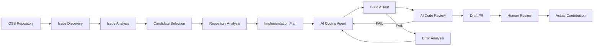

AI는 Draft PR 생성까지 자동화하고, 실제 PR 제출/수정/머지는 사용자가 최종 승인한다.

## 2. Goals

### Primary Goal

사용자가 등록한 OSS Repository에서 AI가 기여 후보 Issue를 자동으로 발굴하고, 구현 가능한 Issue에 대해 코드 수정과 테스트를 수행한 후 Draft PR을 생성한다.

### Secondary Goals

- Repository별 Contribution Rule 자동 분석
- Issue 난이도 및 구현 가능성 분석
- 관련 소스코드 자동 탐색
- 테스트 코드 자동 생성
- 실패 시 AI 기반 수정 재시도
- AI 변경 코드 자동 검증
- OSS별 PR Template 자동 적용
- Contribution 작업 전체 이력 저장

### Goal Workflow


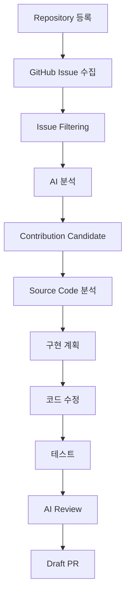

## 3. Non-Goals

- 자동 Merge
- 원본 Repository 직접 Push
- 모든 프로그래밍 언어 지원
- 모든 GitHub Repository 자동 구현
- 검증되지 않은 코드의 자동 PR 제출

## 4. Target User

Java/Spring 개발자를 주요 사용자로 한다.

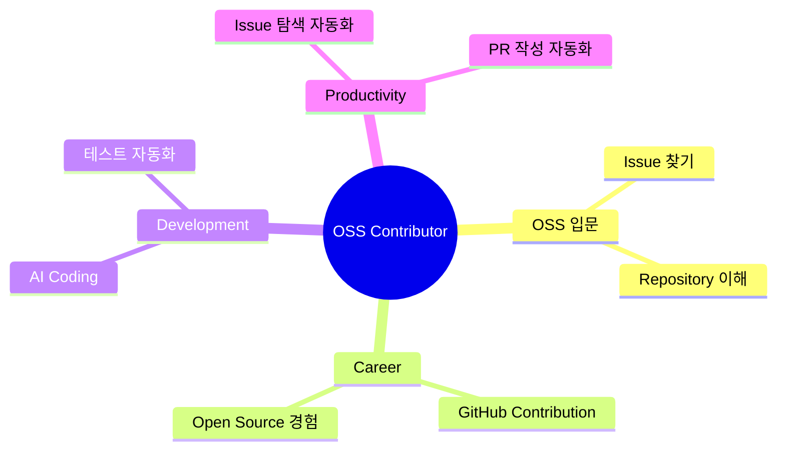

## 5. Initial OSS Scope

### Phase 1

`spring-projects/spring-kafka`

### Phase 2

- `spring-projects/spring-framework`
- `spring-projects/spring-data-redis`
- `spring-projects/spring-boot`
- `reactor/reactor-core`

### Phase 3

- `apache/kafka`
- `redis/redis`

Repository는 시스템에서 동적으로 등록할 수 있도록 설계한다.

## 6. System Architecture

### 6.1 High-Level Architecture


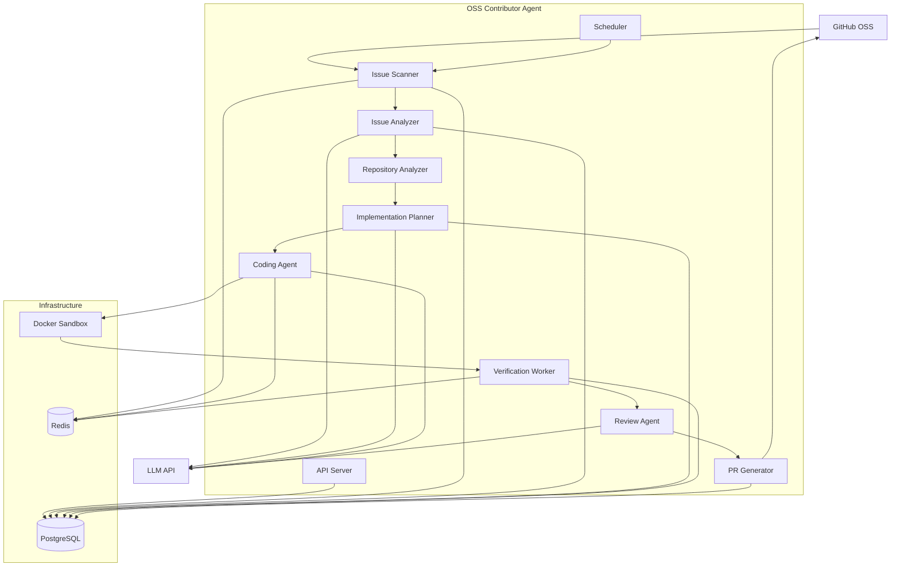

### 6.2 Application Architecture

MVP는 Microservice가 아닌 Modular Monolith으로 구현한다.

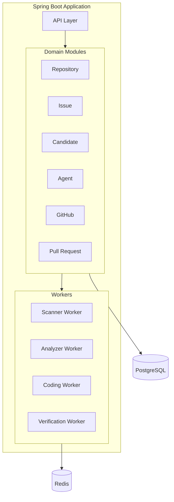

## 7. OSS Scan Workflow

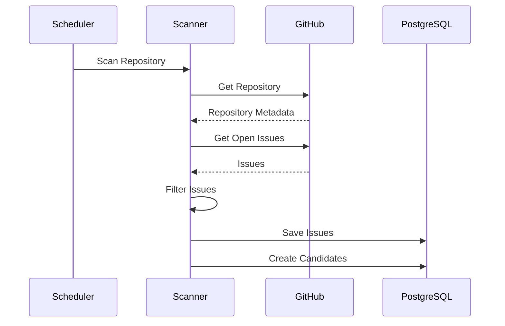

## 8. Repository Policy Analysis

Repository마다 Contribution 규칙이 다르므로 최초 분석 시 관련 문서를 수집한다.

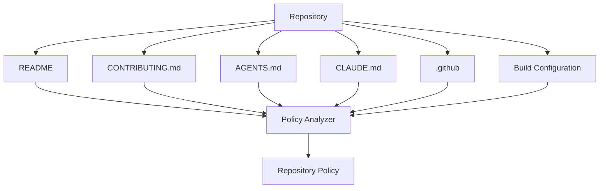

## 9. Issue Discovery

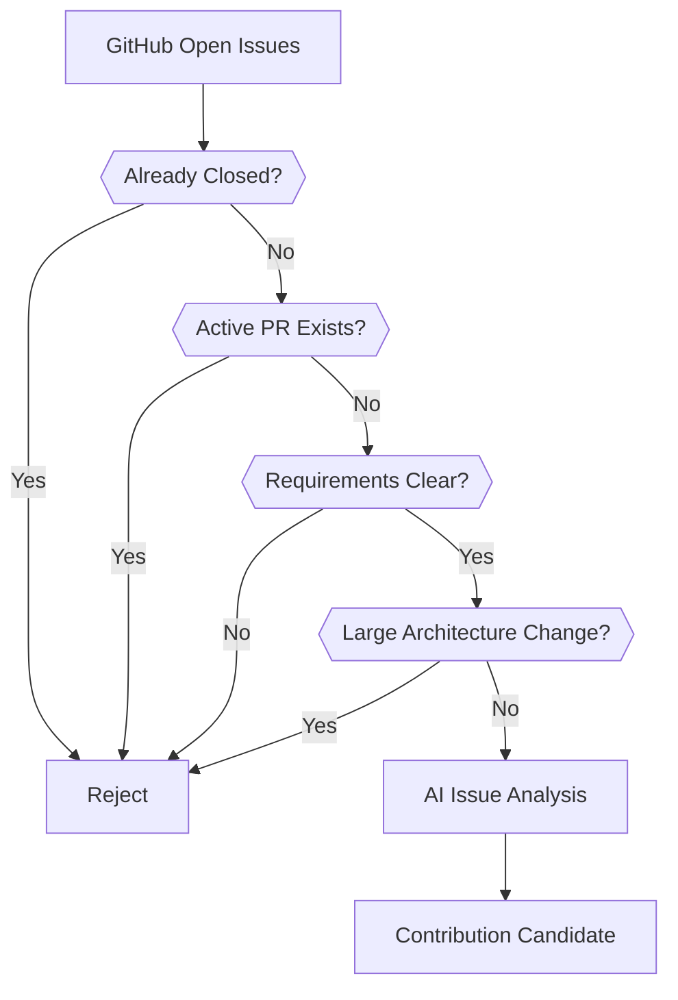

우선 탐색 Label:

- `good first issue`
- `help wanted`
- `bug`
- `enhancement`
- `documentation`

## 10. Candidate State Machine


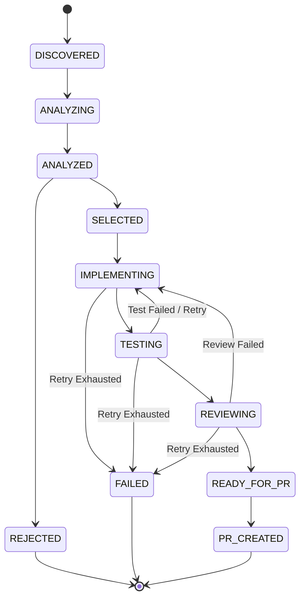

## 11. Issue Analysis

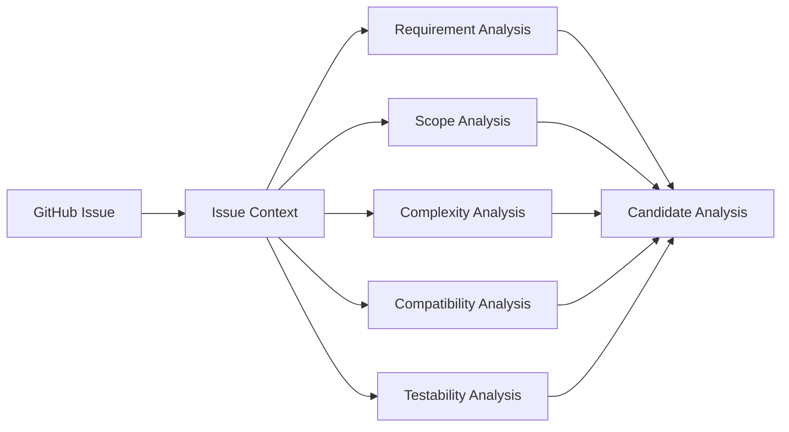

Output:

```json
{
  "category": "enhancement",
  "difficulty": "MEDIUM",
  "implementationFeasible": true,
  "estimatedFiles": 4,
  "estimatedLoc": 120,
  "testRequired": true,
  "breakingChange": false,
  "confidence": 0.87
}
```

## 12. Repository Analysis

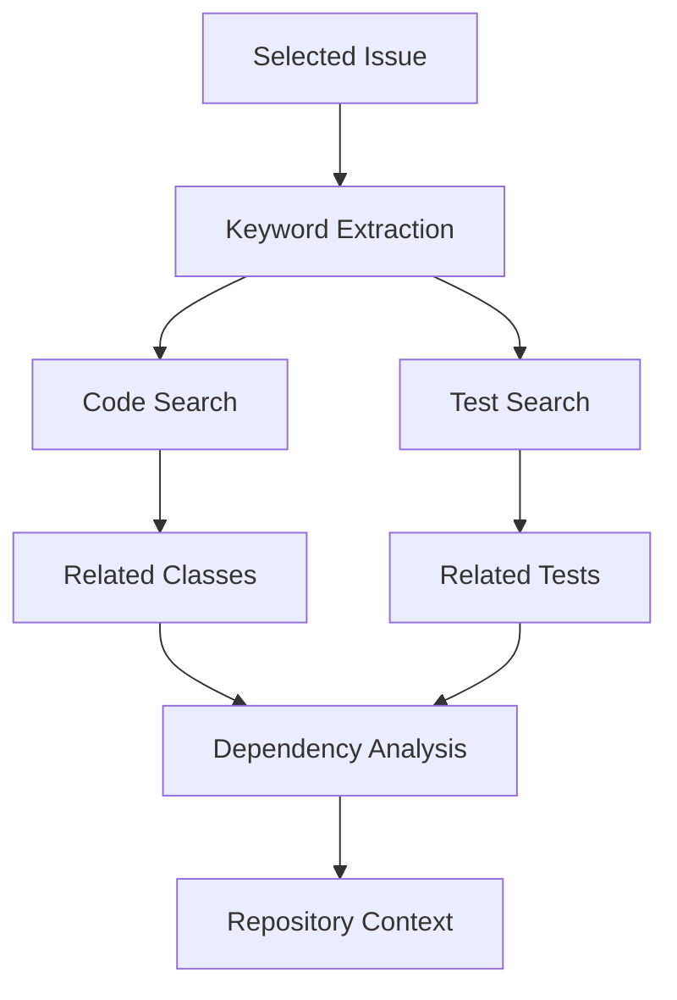

LLM에 Repository 전체를 전달하지 않고 관련 파일을 단계적으로 좁혀서 전달한다.

## 13. Implementation Planning

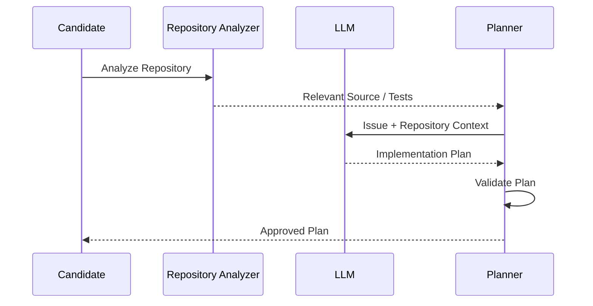

## 14. Coding Agent


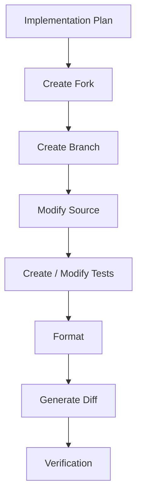

Branch Naming:

`oss-agent/issue-{issueNumber}-{short-description}`

## 15. Verification Pipeline

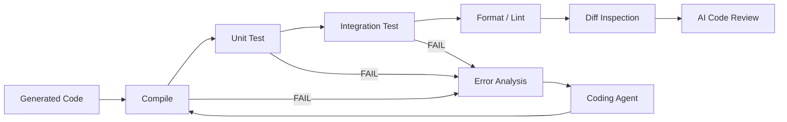

## 16. Docker Sandbox

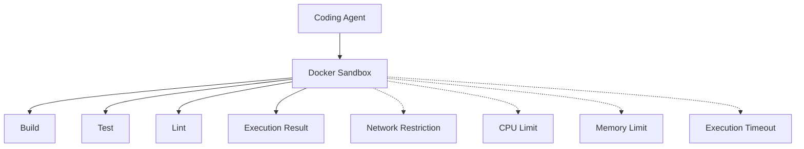

## 17. Retry Strategy

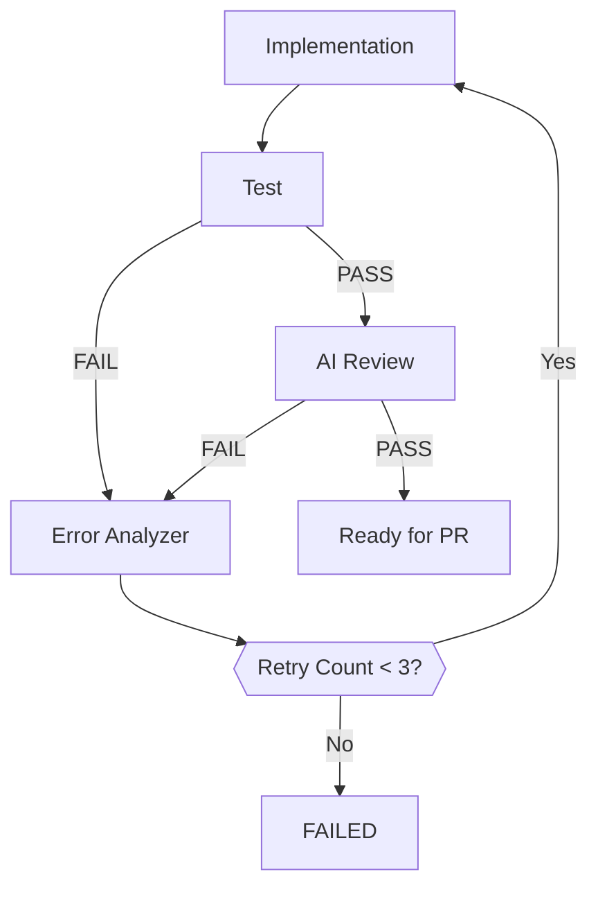

## 18. GitHub Contribution Flow


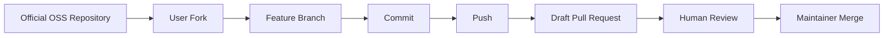

원본 Repository에 직접 Push하지 않는다.

## 19. Pull Request Generation

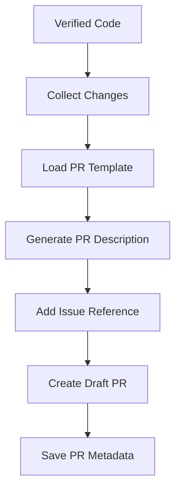

## 20. Human-in-the-loop

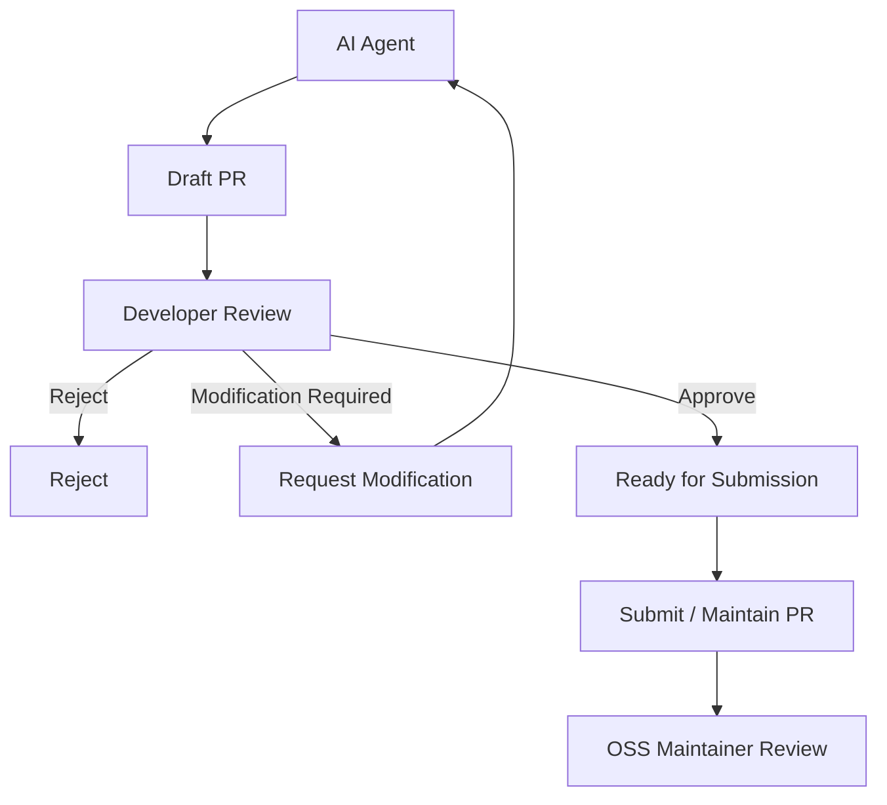

AI는 자동 Merge하지 않는다.

## 21. Redis Job Architecture

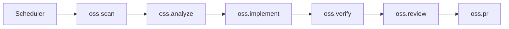

MVP에서는 Scheduler + DB 기반으로 시작하고, Worker 분리가 필요한 시점에 Redis Streams를 적용한다.

## 22. Database ERD


```mermaid
erDiagram
    REPOSITORY ||--o{ ISSUE : contains
    REPOSITORY ||--|| REPOSITORY_POLICY : has
    ISSUE ||--o| CONTRIBUTION_CANDIDATE : becomes
    CONTRIBUTION_CANDIDATE ||--o{ AGENT_RUN : executes
    CONTRIBUTION_CANDIDATE ||--o{ GENERATED_CHANGE : generates
    CONTRIBUTION_CANDIDATE ||--o| PULL_REQUEST : creates

    REPOSITORY {
        bigint id PK
        varchar owner
        varchar name
        varchar url
        varchar default_branch
        varchar language
        varchar build_tool
        varchar build_command
        boolean enabled
        timestamp last_scanned_at
    }

    REPOSITORY_POLICY {
        bigint id PK
        bigint repository_id FK
        varchar java_version
        varchar build_command
        varchar test_command
        boolean issue_reference_required
        boolean signoff_required
        boolean tests_required
        text contribution_rules
    }

    ISSUE {
        bigint id PK
        bigint repository_id FK
        int github_issue_number
        varchar title
        text body
        varchar state
        varchar url
        timestamp created_at
        timestamp updated_at
    }

    CONTRIBUTION_CANDIDATE {
        bigint id PK
        bigint issue_id FK
        varchar category
        varchar difficulty
        int estimated_files
        int estimated_loc
        boolean implementation_feasible
        boolean breaking_change
        decimal confidence
        text analysis
        varchar status
    }

    AGENT_RUN {
        bigint id PK
        bigint candidate_id FK
        varchar stage
        int attempt
        int input_tokens
        int output_tokens
        varchar status
        text error_message
        timestamp started_at
        timestamp finished_at
    }

    GENERATED_CHANGE {
        bigint id PK
        bigint candidate_id FK
        varchar branch_name
        varchar commit_sha
        text diff
        text test_result
        text review_result
    }

    PULL_REQUEST {
        bigint id PK
        bigint candidate_id FK
        varchar fork_url
        varchar branch_name
        int github_pr_number
        varchar pr_url
        varchar status
    }
```

## 23. API

### Repository

```http
POST /api/repositories
GET /api/repositories
POST /api/repositories/{id}/scan
```

### Candidate

```http
GET /api/candidates
GET /api/candidates/{id}
POST /api/candidates/{id}/analyze
POST /api/candidates/{id}/implement
POST /api/candidates/{id}/verify
POST /api/candidates/{id}/pull-request
```

## 24. API Workflow

```mermaid
sequenceDiagram
    participant U as User
    participant API as OSS Agent API
    participant DB as PostgreSQL
    participant W as Worker
    participant GH as GitHub
    participant LLM as LLM

    U->>API: POST /repositories/{id}/scan
    API->>DB: Create Scan Job
    W->>GH: Get Issues
    GH-->>W: Issues
    W->>LLM: Analyze Issues
    LLM-->>W: Candidates
    W->>DB: Save Candidates

    U->>API: POST /candidates/{id}/implement
    W->>GH: Create Fork / Branch
    W->>LLM: Implementation Plan
    LLM-->>W: Plan
    W->>W: Modify Code
    W->>W: Run Tests
    W->>LLM: Review Diff
    LLM-->>W: Review Result
    W->>GH: Create Draft PR
    GH-->>W: PR URL
    W->>DB: Save PR
    API-->>U: Draft PR
```

## 25. Security Architecture

```mermaid
flowchart TB
    GitHub[GitHub Repository]
    --> Clone[Repository Clone]
    Clone --> Sandbox[Isolated Docker Sandbox]
    Sandbox --> Build[Build / Test]

    Sandbox -.-> Internet[Restricted Network]
    Sandbox -.-> Filesystem[Isolated Filesystem]
    Sandbox -.-> Resources[CPU / Memory Limit]

    GitHubApp[GitHub App]
    --> Permission[Minimal Repository Permissions]
    Permission --> GitHub
```

원칙:

- GitHub Token 최소 권한
- 원본 Repository 직접 Push 금지
- Build는 Sandbox에서 실행
- Network 제한
- CPU/Memory 제한
- 실행 Timeout
- Secret 환경변수 직접 노출 금지

## 26. Observability

```mermaid
flowchart LR
    Scan[Scan] --> Analyze[Analyze] --> Plan[Plan] --> Implement[Implement]
    Implement --> Test[Test] --> Review[Review] --> PR[PR]
```

수집 Metric:

```text
candidate_count
analysis_success_rate
implementation_success_rate
test_pass_rate
review_pass_rate
retry_count
pr_created_count
pr_merged_count
llm_token_usage
llm_cost
execution_time
```

## 27. MVP Roadmap

### Phase 1 — Issue Discovery


- Repository 등록
- GitHub Issue 조회
- Issue Filtering
- AI 분석
- Candidate 생성
- Dashboard 조회

### Phase 2 — AI Coding

```mermaid
flowchart LR
    A[Candidate] --> B[Repository Analysis] --> C[Implementation Plan]
    C --> D[Code Modification] --> E[Test] --> F[AI Review]
```

### Phase 3 — GitHub PR

```mermaid
flowchart LR
    A[Verified Code] --> B[Fork] --> C[Branch] --> D[Commit] --> E[Push] --> F[Draft PR]
```

### Phase 4 — Automation

```mermaid
flowchart TD
    Scheduler[Daily Scheduler]
    --> Scanner[OSS Scanner]
    --> Analyzer[Issue Analyzer]
    --> Candidate[Candidate]

    Candidate --> Notification[Notification]
    Candidate --> Implementation[Optional Auto Implementation]
    Implementation --> Verification
    Verification --> DraftPR[Draft PR]
```

## 28. MVP End-to-End Definition


```mermaid
flowchart TD
    A[Spring Kafka]
    --> B[Issue 발견]
    --> C[Issue 분석]
    --> D[Candidate 선정]
    --> E[Repository 분석]
    --> F[Implementation Plan]
    --> G[AI Code 수정]
    --> H[Build / Test]
    --> I[AI Review]
    --> J[Fork]
    --> K[Branch]
    --> L[Commit]
    --> M[Draft PR]
    --> N[Human Review]
```

MVP의 핵심 질문:

> 개발자가 Spring Kafka에서 기여할 만한 Issue 하나를 선택하면, 시스템이 실제 코드를 수정하고 테스트한 뒤 GitHub에 검토 가능한 Draft PR까지 만들어줄 수 있는가?

이 질문에 대한 End-to-End 구현을 가장 중요한 MVP 성공 기준으로 한다.

## 29. Future Expansion

### Multi-Repository

```mermaid
flowchart LR
    Agent[OSS Agent]
    --> Spring[Spring]
    Agent --> Kafka[Kafka]
    Agent --> Redis[Redis]
    Agent --> Reactor[Reactor]
    Agent --> Hibernate[Hibernate]
```

### Maintainer Feedback Loop

```mermaid
sequenceDiagram
    participant GH as GitHub
    participant Agent as OSS Agent
    participant User as Developer

    GH->>Agent: PR Comment Webhook
    Agent->>Agent: Analyze Feedback
    Agent->>User: Proposed Changes
    User->>Agent: Approve
    Agent->>Agent: Modify Code
    Agent->>GH: Push New Commit
```

### Contribution History

```mermaid
flowchart LR
    User --> Repositories --> Issues --> PRs --> MergedPRs
```

## 30. Product Definition

AI OSS Contributor Agent는 단순한 AI Code Generator가 아니다.

핵심은 **Software Engineering Workflow Automation**이다.


```mermaid
flowchart LR
    Discover --> Analyze --> Plan --> Implement --> Verify --> Review --> GeneratePR --> HumanApproval
```

AI는 Issue 탐색부터 Draft PR 생성까지의 반복적인 개발 workflow를 자동화하고, Build/Test/Review를 통해 비결정적인 AI 코드 생성을 검증한다.

최종적으로 사용자는 AI가 생성한 변경사항을 검토한 후 실제 OSS에 제출할지 결정한다.
