# AI OSS Contributor Agent
## Product Requirements Document

**Version:** 1.2  
**Status:** Draft

> AI가 Java/Spring 오픈소스의 GitHub Issue를 탐색하고, 기여 가능성을 분석한 뒤 코드 구현·테스트·검증을 수행하고 Draft Pull Request까지 생성하는 개발자용 OSS Contribution Agent.

## 1. Product Overview

### 핵심 Workflow


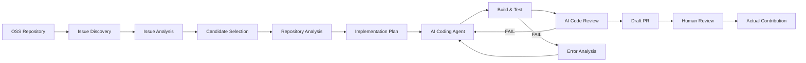
```mermaid
flowchart LR
    A[OSS Repository] --> B[Issue Discovery]
    B --> C[Issue Analysis]
    C --> D[Candidate Selection]
    D --> E[Repository Analysis]
    E --> F[Implementation Plan]
    F --> G[AI Coding Agent]
    G --> H[Build & Test]
    H --> I[AI Code Review]
    I --> J[Draft PR]
    J --> K[Human Review]
    K --> L[Actual Contribution]

    H -->|FAIL| M[Error Analysis]
    M --> G

    I -->|FAIL| G
```

AI는 Draft PR 생성까지 자동화하고, 실제 PR 제출/수정/머지는 사용자가 최종 승인한다.

## 2. Goals

### Primary Goal

사용자가 등록한 OSS Repository에서 AI가 기여 후보 Issue를 자동으로 발굴하고, 구현 가능한 Issue에 대해 코드 수정과 테스트를 수행한 후 Draft PR을 생성한다.

### Secondary Goals

- Repository별 Contribution Rule 자동 분석
- Issue 난이도 및 구현 가능성 분석
- 관련 소스코드 자동 탐색
- 테스트 코드 자동 생성
- 실패 시 AI 기반 수정 재시도
- AI 변경 코드 자동 검증
- OSS별 PR Template 자동 적용
- Contribution 작업 전체 이력 저장

### Goal Workflow


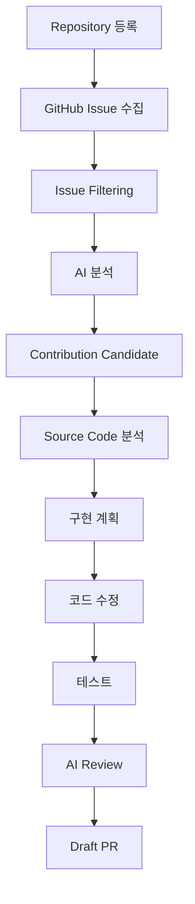
```mermaid
flowchart TD
    A[Repository 등록]
    --> B[GitHub Issue 수집]
    --> C[Issue Filtering]
    --> D[AI 분석]
    --> E[Contribution Candidate]
    --> F[Source Code 분석]
    --> G[구현 계획]
    --> H[코드 수정]
    --> I[테스트]
    --> J[AI Review]
    --> K[Draft PR]
```

## 3. Non-Goals

- 자동 Merge
- 원본 Repository 직접 Push
- 모든 프로그래밍 언어 지원
- 모든 GitHub Repository 자동 구현
- 검증되지 않은 코드의 자동 PR 제출

## 4. Target User

Java/Spring 개발자를 주요 사용자로 한다.

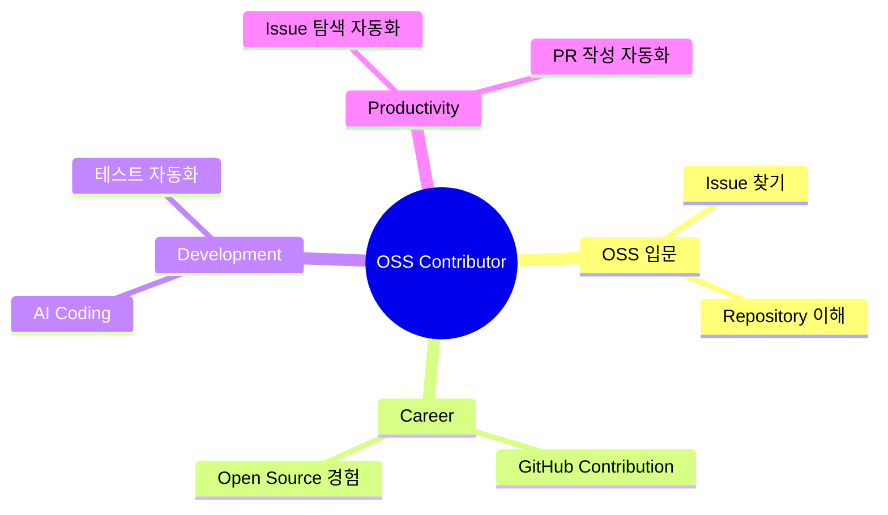
```mermaid
mindmap
  root((OSS Contributor))
    OSS 입문
      Issue 찾기
      Repository 이해
    Career
      GitHub Contribution
      Open Source 경험
    Development
      AI Coding
      테스트 자동화
    Productivity
      Issue 탐색 자동화
      PR 작성 자동화
```

## 5. Initial OSS Scope

### Phase 1

`spring-projects/spring-kafka`

### Phase 2

- `spring-projects/spring-framework`
- `spring-projects/spring-data-redis`
- `spring-projects/spring-boot`
- `reactor/reactor-core`

### Phase 3

- `apache/kafka`
- `redis/redis`

Repository는 시스템에서 동적으로 등록할 수 있도록 설계한다.

## 6. System Architecture

### 6.1 High-Level Architecture


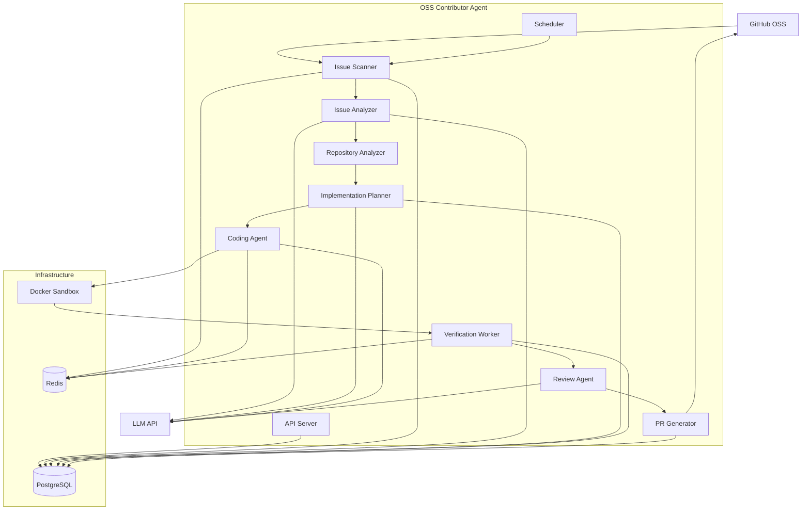
```mermaid
flowchart TB
    GitHub[GitHub OSS]

    subgraph Application[OSS Contributor Agent]
        API[API Server]
        Scheduler[Scheduler]
        Scanner[Issue Scanner]
        Analyzer[Issue Analyzer]
        RepoAnalyzer[Repository Analyzer]
        Planner[Implementation Planner]
        Coding[Coding Agent]
        Verification[Verification Worker]
        Reviewer[Review Agent]
        PR[PR Generator]
    end

    subgraph Infrastructure
        PostgreSQL[(PostgreSQL)]
        Redis[(Redis)]
        Docker[Docker Sandbox]
    end

    LLM[LLM API]

    GitHub --> Scanner
    Scheduler --> Scanner
    Scanner --> Analyzer
    Analyzer --> RepoAnalyzer
    RepoAnalyzer --> Planner
    Planner --> Coding
    Coding --> Docker
    Docker --> Verification
    Verification --> Reviewer
    Reviewer --> PR
    PR --> GitHub

    Analyzer --> LLM
    Planner --> LLM
    Coding --> LLM
    Reviewer --> LLM

    API --> PostgreSQL
    Scanner --> PostgreSQL
    Analyzer --> PostgreSQL
    Planner --> PostgreSQL
    Verification --> PostgreSQL
    PR --> PostgreSQL

    Scanner --> Redis
    Coding --> Redis
    Verification --> Redis
```

### 6.2 Application Architecture

MVP는 Microservice가 아닌 Modular Monolith으로 구현한다.

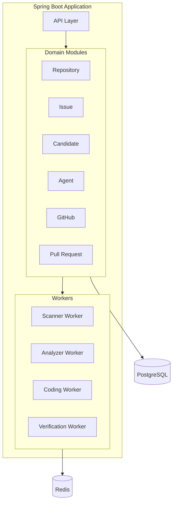
```mermaid
flowchart TB
    subgraph SpringBoot[Spring Boot Application]
        API[API Layer]

        subgraph Domain[Domain Modules]
            Repository[Repository]
            Issue[Issue]
            Candidate[Candidate]
            Agent[Agent]
            GitHub[GitHub]
            PullRequest[Pull Request]
        end

        subgraph Workers[Workers]
            Scanner[Scanner Worker]
            Analyzer[Analyzer Worker]
            Coding[Coding Worker]
            Verification[Verification Worker]
        end

        API --> Domain
        Domain --> Workers
    end

    DB[(PostgreSQL)]
    Redis[(Redis)]

    Domain --> DB
    Workers --> Redis
```

## 7. OSS Scan Workflow

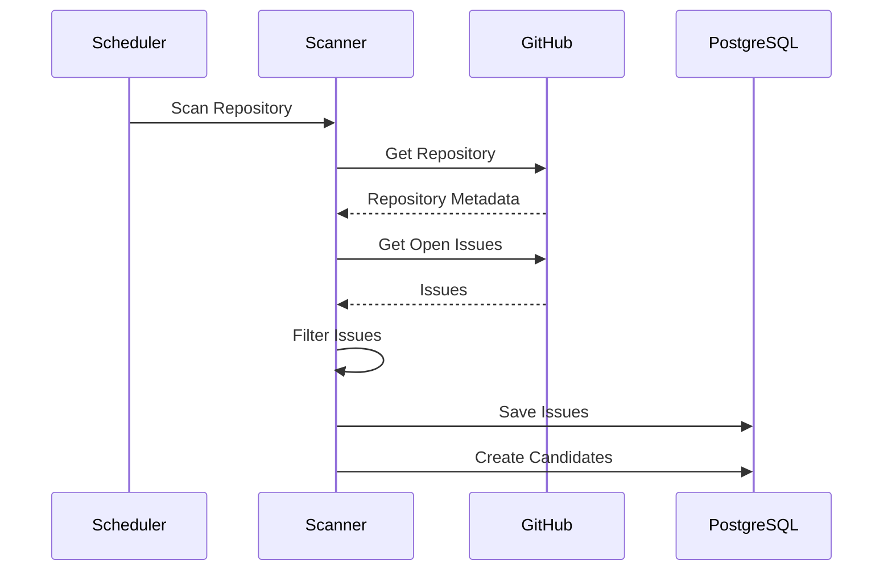
```mermaid
sequenceDiagram
    participant S as Scheduler
    participant SC as Scanner
    participant GH as GitHub
    participant DB as PostgreSQL

    S->>SC: Scan Repository
    SC->>GH: Get Repository
    GH-->>SC: Repository Metadata
    SC->>GH: Get Open Issues
    GH-->>SC: Issues
    SC->>SC: Filter Issues
    SC->>DB: Save Issues
    SC->>DB: Create Candidates
```

## 8. Repository Policy Analysis

Repository마다 Contribution 규칙이 다르므로 최초 분석 시 관련 문서를 수집한다.

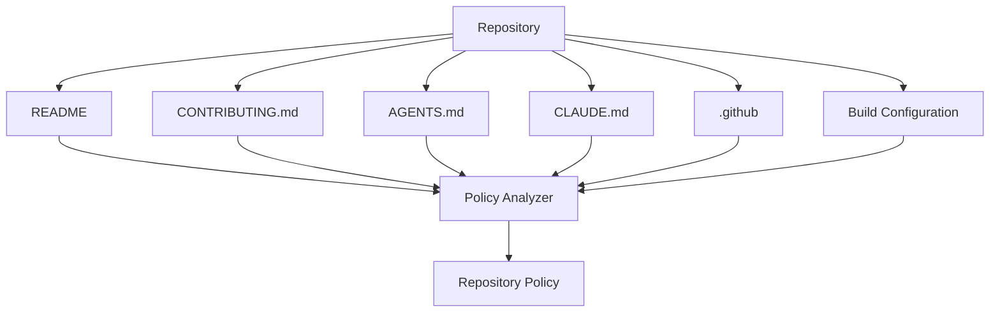
```mermaid
flowchart TD
    A[Repository]
    --> B[README]
    A --> C[CONTRIBUTING.md]
    A --> D[AGENTS.md]
    A --> E[CLAUDE.md]
    A --> F[.github]
    A --> G[Build Configuration]

    B --> H[Policy Analyzer]
    C --> H
    D --> H
    E --> H
    F --> H
    G --> H

    H --> I[Repository Policy]
```

## 9. Issue Discovery

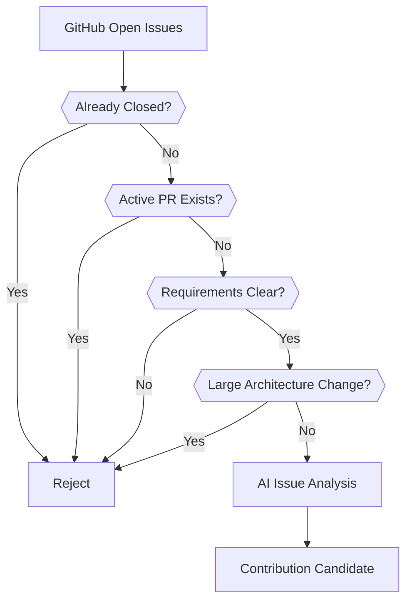
```mermaid
flowchart TD
    A[GitHub Open Issues]
    --> B{{Already Closed?}}
    B -->|Yes| X[Reject]
    B -->|No| C{{Active PR Exists?}}
    C -->|Yes| X
    C -->|No| D{{Requirements Clear?}}
    D -->|No| X
    D -->|Yes| E{{Large Architecture Change?}}
    E -->|Yes| X
    E -->|No| F[AI Issue Analysis]
    F --> G[Contribution Candidate]
```

우선 탐색 Label:

- `good first issue`
- `help wanted`
- `bug`
- `enhancement`
- `documentation`

## 10. Candidate State Machine


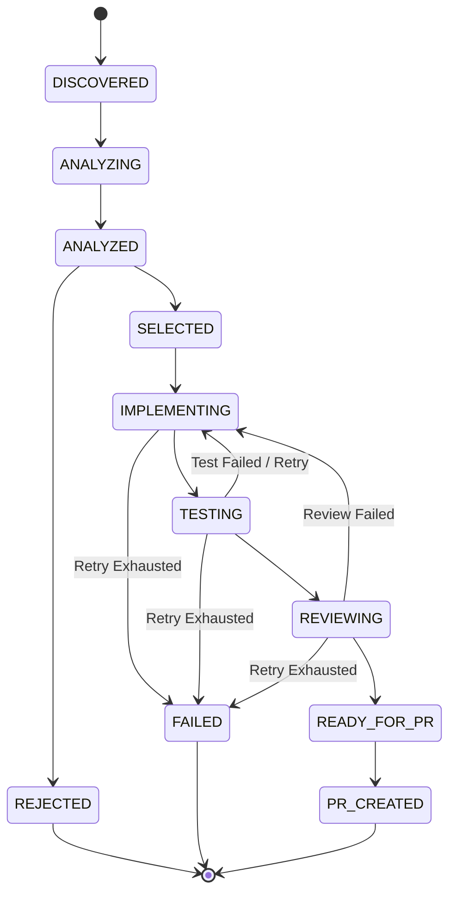
```mermaid
stateDiagram-v2
    [*] --> DISCOVERED
    DISCOVERED --> ANALYZING
    ANALYZING --> ANALYZED
    ANALYZED --> SELECTED
    ANALYZED --> REJECTED
    SELECTED --> IMPLEMENTING
    IMPLEMENTING --> TESTING
    TESTING --> REVIEWING
    TESTING --> IMPLEMENTING: Test Failed / Retry
    REVIEWING --> READY_FOR_PR
    REVIEWING --> IMPLEMENTING: Review Failed
    READY_FOR_PR --> PR_CREATED
    IMPLEMENTING --> FAILED: Retry Exhausted
    TESTING --> FAILED: Retry Exhausted
    REVIEWING --> FAILED: Retry Exhausted
    REJECTED --> [*]
    FAILED --> [*]
    PR_CREATED --> [*]
```

## 11. Issue Analysis

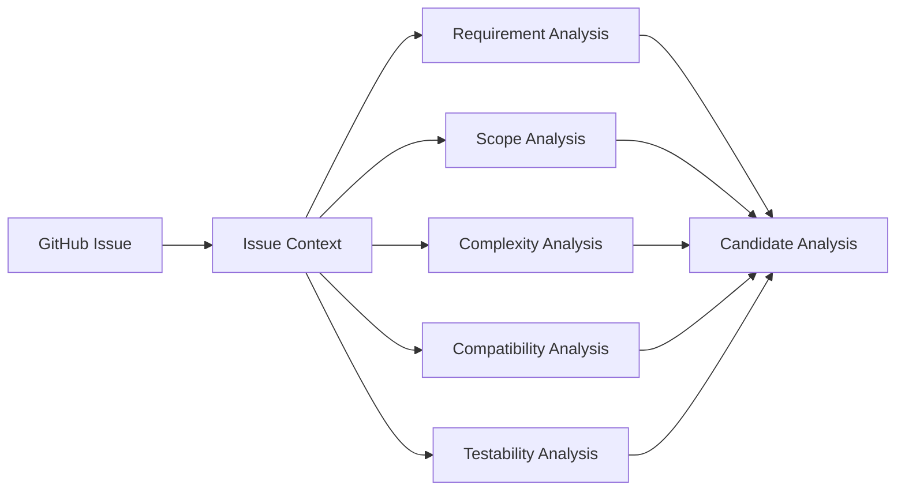
```mermaid
flowchart LR
    Issue[GitHub Issue] --> Context[Issue Context]
    Context --> Requirement[Requirement Analysis]
    Context --> Scope[Scope Analysis]
    Context --> Complexity[Complexity Analysis]
    Context --> Compatibility[Compatibility Analysis]
    Context --> Testability[Testability Analysis]

    Requirement --> Result[Candidate Analysis]
    Scope --> Result
    Complexity --> Result
    Compatibility --> Result
    Testability --> Result
```

Output:

```json
{
  "category": "enhancement",
  "difficulty": "MEDIUM",
  "implementationFeasible": true,
  "estimatedFiles": 4,
  "estimatedLoc": 120,
  "testRequired": true,
  "breakingChange": false,
  "confidence": 0.87
}
```

## 12. Repository Analysis

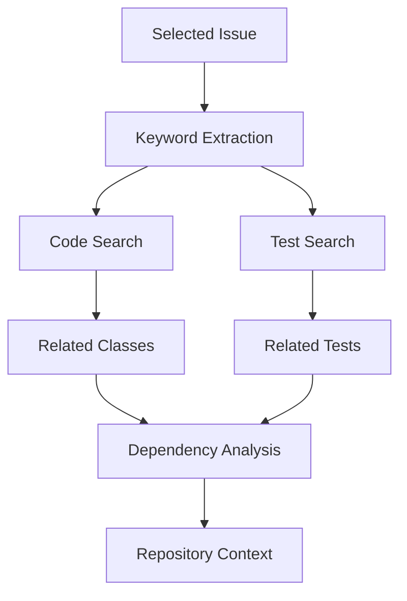
```mermaid
flowchart TD
    A[Selected Issue] --> B[Keyword Extraction]
    B --> C[Code Search]
    B --> D[Test Search]
    C --> E[Related Classes]
    D --> F[Related Tests]
    E --> G[Dependency Analysis]
    F --> G
    G --> H[Repository Context]
```

LLM에 Repository 전체를 전달하지 않고 관련 파일을 단계적으로 좁혀서 전달한다.

## 13. Implementation Planning

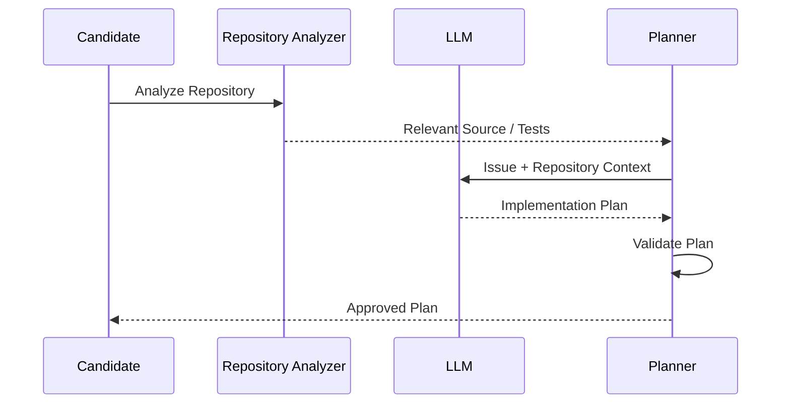
```mermaid
sequenceDiagram
    participant C as Candidate
    participant R as Repository Analyzer
    participant L as LLM
    participant P as Planner

    C->>R: Analyze Repository
    R-->>P: Relevant Source / Tests
    P->>L: Issue + Repository Context
    L-->>P: Implementation Plan
    P->>P: Validate Plan
    P-->>C: Approved Plan
```

## 14. Coding Agent


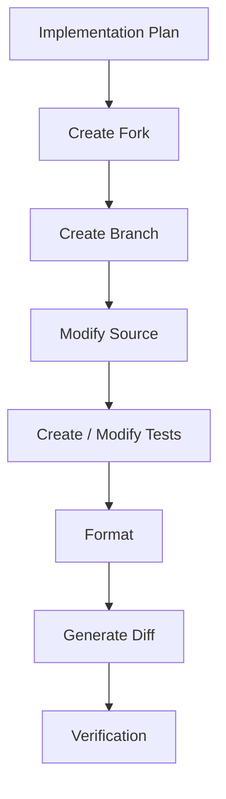
```mermaid
flowchart TD
    A[Implementation Plan]
    --> B[Create Fork]
    B --> C[Create Branch]
    C --> D[Modify Source]
    D --> E[Create / Modify Tests]
    E --> F[Format]
    F --> G[Generate Diff]
    G --> H[Verification]
```

Branch Naming:

`oss-agent/issue-{issueNumber}-{short-description}`

## 15. Verification Pipeline

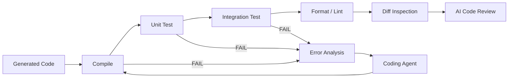
```mermaid
flowchart LR
    Code[Generated Code] --> Compile[Compile]
    Compile --> Unit[Unit Test]
    Unit --> Integration[Integration Test]
    Integration --> Format[Format / Lint]
    Format --> Diff[Diff Inspection]
    Diff --> Review[AI Code Review]

    Compile -->|FAIL| Error[Error Analysis]
    Unit -->|FAIL| Error
    Integration -->|FAIL| Error

    Error --> Coding[Coding Agent]
    Coding --> Compile
```

## 16. Docker Sandbox

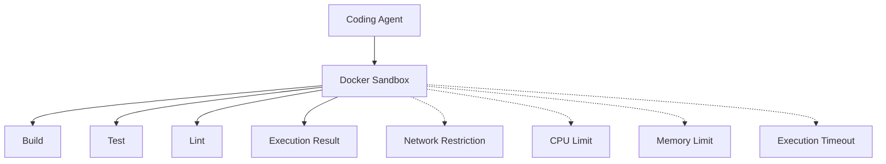
```mermaid
flowchart TB
    Agent[Coding Agent] --> Sandbox[Docker Sandbox]
    Sandbox --> Build[Build]
    Sandbox --> Test[Test]
    Sandbox --> Lint[Lint]
    Sandbox --> Result[Execution Result]

    Sandbox -.-> Network[Network Restriction]
    Sandbox -.-> CPU[CPU Limit]
    Sandbox -.-> Memory[Memory Limit]
    Sandbox -.-> Timeout[Execution Timeout]
```

## 17. Retry Strategy

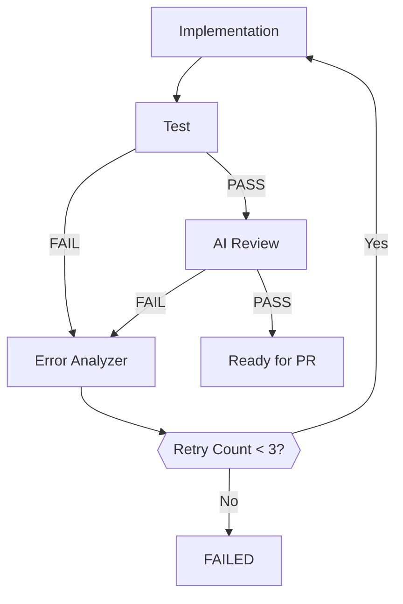
```mermaid
flowchart TD
    A[Implementation] --> B[Test]
    B -->|PASS| C[AI Review]
    B -->|FAIL| D[Error Analyzer]
    D --> E{{Retry Count < 3?}}
    E -->|Yes| A
    E -->|No| F[FAILED]
    C -->|PASS| G[Ready for PR]
    C -->|FAIL| D
```

## 18. GitHub Contribution Flow


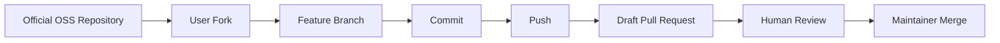
```mermaid
flowchart LR
    OSS[Official OSS Repository]
    --> Fork[User Fork]
    Fork --> Branch[Feature Branch]
    Branch --> Commit[Commit]
    Commit --> Push[Push]
    Push --> PR[Draft Pull Request]
    PR --> Human[Human Review]
    Human --> Merge[Maintainer Merge]
```

원본 Repository에 직접 Push하지 않는다.

## 19. Pull Request Generation

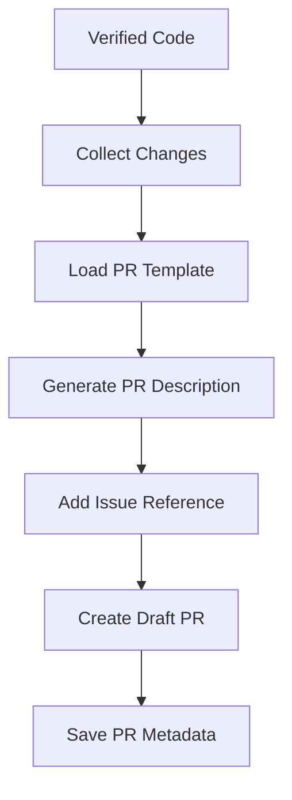
```mermaid
flowchart TD
    A[Verified Code]
    --> B[Collect Changes]
    B --> C[Load PR Template]
    C --> D[Generate PR Description]
    D --> E[Add Issue Reference]
    E --> F[Create Draft PR]
    F --> G[Save PR Metadata]
```

## 20. Human-in-the-loop

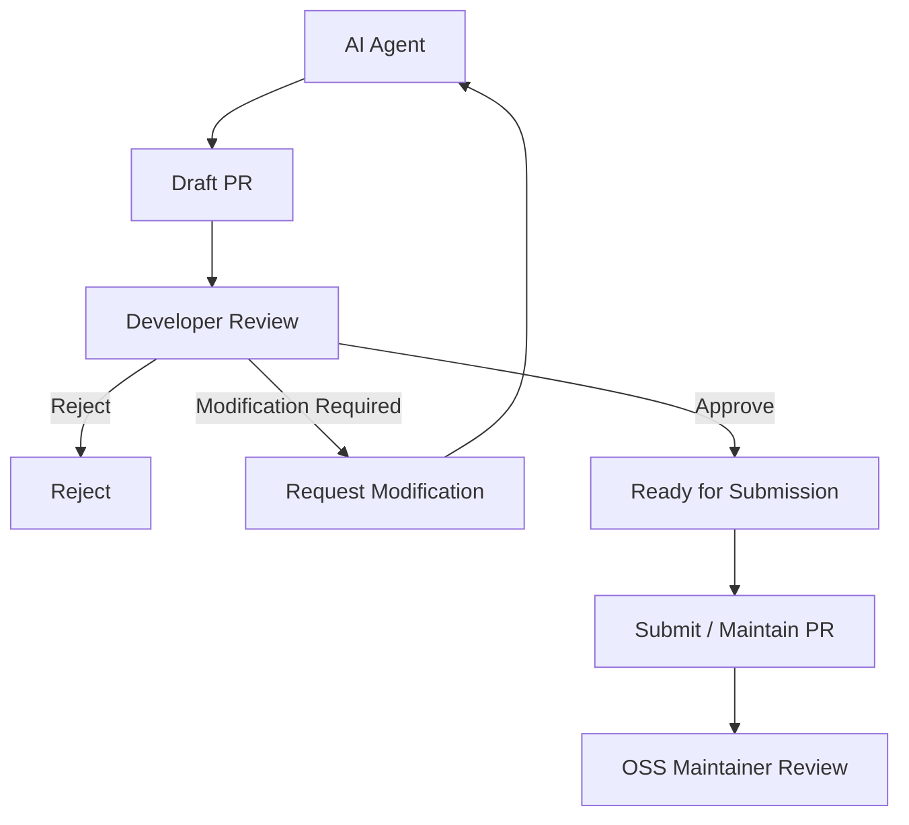
```mermaid
flowchart TD
    AI[AI Agent] --> Draft[Draft PR]
    Draft --> User[Developer Review]
    User -->|Reject| Reject[Reject]
    User -->|Modification Required| Modify[Request Modification]
    User -->|Approve| Ready[Ready for Submission]
    Modify --> AI
    Ready --> OSS[Submit / Maintain PR]
    OSS --> Maintainer[OSS Maintainer Review]
```

AI는 자동 Merge하지 않는다.

## 21. Redis Job Architecture

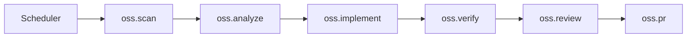
```mermaid
flowchart LR
    Scheduler[Scheduler]
    --> Scan[oss.scan]
    Scan --> Analyze[oss.analyze]
    Analyze --> Implement[oss.implement]
    Implement --> Verify[oss.verify]
    Verify --> Review[oss.review]
    Review --> PR[oss.pr]
```

MVP에서는 Scheduler + DB 기반으로 시작하고, Worker 분리가 필요한 시점에 Redis Streams를 적용한다.

## 22. Database ERD


```mermaid
erDiagram
    REPOSITORY ||--o{ ISSUE : contains
    REPOSITORY ||--|| REPOSITORY_POLICY : has
    ISSUE ||--o| CONTRIBUTION_CANDIDATE : becomes
    CONTRIBUTION_CANDIDATE ||--o{ AGENT_RUN : executes
    CONTRIBUTION_CANDIDATE ||--o{ GENERATED_CHANGE : generates
    CONTRIBUTION_CANDIDATE ||--o| PULL_REQUEST : creates

    REPOSITORY {
        bigint id PK
        varchar owner
        varchar name
        varchar url
        varchar default_branch
        varchar language
        varchar build_tool
        varchar build_command
        boolean enabled
        timestamp last_scanned_at
    }

    REPOSITORY_POLICY {
        bigint id PK
        bigint repository_id FK
        varchar java_version
        varchar build_command
        varchar test_command
        boolean issue_reference_required
        boolean signoff_required
        boolean tests_required
        text contribution_rules
    }

    ISSUE {
        bigint id PK
        bigint repository_id FK
        int github_issue_number
        varchar title
        text body
        varchar state
        varchar url
        timestamp created_at
        timestamp updated_at
    }

    CONTRIBUTION_CANDIDATE {
        bigint id PK
        bigint issue_id FK
        varchar category
        varchar difficulty
        int estimated_files
        int estimated_loc
        boolean implementation_feasible
        boolean breaking_change
        decimal confidence
        text analysis
        varchar status
    }

    AGENT_RUN {
        bigint id PK
        bigint candidate_id FK
        varchar stage
        int attempt
        int input_tokens
        int output_tokens
        varchar status
        text error_message
        timestamp started_at
        timestamp finished_at
    }

    GENERATED_CHANGE {
        bigint id PK
        bigint candidate_id FK
        varchar branch_name
        varchar commit_sha
        text diff
        text test_result
        text review_result
    }

    PULL_REQUEST {
        bigint id PK
        bigint candidate_id FK
        varchar fork_url
        varchar branch_name
        int github_pr_number
        varchar pr_url
        varchar status
    }
```

## 23. API

### Repository

```http
POST   /api/repositories
GET    /api/repositories
POST   /api/repositories/{id}/scan              # 202 Accepted — 비동기
GET    /api/repositories/{id}/scan              # 진행 상태 조회
POST   /api/repositories/{id}/policy/resolution # 규약 보류를 사람이 해소한다
```

### Candidate

```http
GET    /api/candidates
GET    /api/candidates/{id}
POST   /api/candidates/{id}/select              # 게이트 1 — 사람이 고른다
POST   /api/candidates/{id}/reject              # 선택 취소 (사람 행위로만)
POST   /api/candidates/{id}/implement           # 게이트 2 — 아직 없다
POST   /api/candidates/{id}/pull-request        # 게이트 3 — 아직 없다
```

**`POST /candidates/{id}/analyze`는 없앴다.** 분석은 스캔 파이프라인의 한 단계이지
사람이 거는 호출이 아니다. 후보는 `ANALYZED` 상태로 만들어진 뒤 §24의 게이트를 기다린다.

`POST /candidates/{id}/verify`는 **열지 말지를 아직 정하지 않았다.** S-6이 세는 승인 지점은
셋(선정·착수·PR 생성)이고 verify는 그중에 없다. 여는 것은 게이트를 하나 늘리는 일이 아니라
**「검증을 사람이 건너뛸 수 있는가」라는 질문을 만드는 일**이라, 검증 파이프라인을 만드는
단계에서 판단한다.

> **게이트 2·3이 아직 없는 것은 일정 문제가 아니다.** 실행기 없이 열면 후보가 각각
> `IMPLEMENTING`(탈출 트리거 없음)과 **PR 없는 종단 `PR_CREATED`**에 갇힌다.
> 실행기와 같은 변경에서 함께 연다.

## 24. API Workflow

```mermaid
sequenceDiagram
    participant U as User
    participant API as OSS Agent API
    participant DB as PostgreSQL
    participant W as Worker
    participant GH as GitHub
    participant LLM as LLM

    U->>API: POST /repositories/{id}/scan
    API->>DB: Create Scan Job
    W->>GH: Get Issues
    GH-->>W: Issues
    W->>LLM: Analyze Issues
    LLM-->>W: Candidates
    W->>DB: Save Candidates

    U->>API: POST /candidates/{id}/select
    API->>DB: SELECTED (사람이 골랐다는 기록)

    U->>API: POST /candidates/{id}/implement
    W->>GH: Create Fork / Branch
    W->>LLM: Implementation Plan
    LLM-->>W: Plan
    W->>W: Modify Code (Sandbox)
    W->>W: Run Tests (Sandbox)
    W->>LLM: Review Diff
    LLM-->>W: Review Result
    W->>DB: READY_FOR_PR
    API-->>U: 변경분 · 검증 결과 (PR 아님)

    U->>API: POST /candidates/{id}/pull-request
    W->>GH: Create Draft PR
    GH-->>W: PR URL
    W->>DB: PR_CREATED
    API-->>U: Draft PR URL
```

### 🔴 v1.1의 이 다이어그램은 틀렸다

v1.1은 **`implement` 호출 하나가 Fork → 계획 → 코딩 → 테스트 → 리뷰 → Draft PR 생성까지**
수행하는 것으로 그려져 있었다. 그대로 구현하면 **세 번째 승인 지점이 사라지고**,
검증되지 않은 AI 코드가 사람의 별도 승인 없이 메인테이너에게 나간다.

§23은 `implement`·`pull-request`를 처음부터 **따로** 두고 있었다 — 두 절이 서로 모순이었고,
**§23이 맞다.** 사람이 거는 호출은 셋이다.

| 게이트 | 무엇을 승인하나 | 없으면 |
|---|---|---|
| `select` | 「이건 해볼 만하다」 — 트리아지 | 스캔이 곧바로 30분짜리 실행으로 이어진다 |
| `implement` | 「돈과 시간을 쓴다」 — LLM 호출 + 샌드박스 최대 30분 | 자동화가 비용을 스스로 결정한다 |
| **`pull-request`** | 「이 diff를 남의 저장소에 보낸다」 | **검증 안 된 코드가 메인테이너 큐로 나간다** |

> 스케줄러는 `ANALYZED`에서 멈춘다. 그 뒤로는 **사람이 세 번 눌러야** Draft PR이 생긴다.

## 25. Security Architecture

### 25.1 인증 — GitHub App도 「최소 권한」도 성립하지 않는다

> v1.1은 `GitHub App → Minimal Repository Permissions → GitHub`으로 그려져 있었다.
> **그 경로는 이 제품의 핵심 시나리오에서 동작하지 않는다.** 근거는 `open-questions.md` Q-1(#2).

upstream에 Pull Request를 만들려면 **대상 저장소 소유자 수준의 권한**이 필요하다.

| 방식 | Fork 생성 | **upstream에 PR 생성** | 판정 |
|---|---|---|---|
| fine-grained PAT | 가능 | **불가** — `403 Resource not accessible by personal access token` | 쓸 수 없다 |
| GitHub App (설치 토큰) | 공개 저장소는 가능 | **불가** — upstream이 우리 App을 설치할 리 없다 | 쓸 수 없다 |
| GitHub App (user-to-server OAuth) | 가능 | 가능 | 다중 사용자 확장 경로 (§29) |
| **classic PAT (`public_repo`)** | 가능 | 가능 | **채택** |

**선택지가 하나뿐이었다.** 트레이드오프 문제가 아니라 둘 중 하나만 동작한다.

### 25.2 그래서 「최소 권한」이라는 방어가 없다

classic PAT의 `public_repo` 스코프는 **저장소별 권한 제한이 불가능**하다.
「원본에는 write를 주지 않는 토큰」이라는 것이 GitHub에 존재하지 않는다.

```mermaid
flowchart TB
    GitHub[Target OSS Repository]
    --> Clone[Repository Clone]
    Clone --> Sandbox[Isolated Docker Sandbox]
    Sandbox --> Build[Build / Test]

    Sandbox -.-> Network[Network - phase dependent]
    Sandbox -.-> Filesystem[Isolated Filesystem]
    Sandbox -.-> Resources[CPU / Memory / PIDs Limit]

    PAT["classic PAT (public_repo)"]
    PAT -.->|read only| Upstream[Upstream Repository]
    PAT --> Assert{{"Fork owner assertion"}}
    Assert -->|owner matches| ForkPush[Push to User Fork]
    Assert -->|mismatch| Abort[Abort - no request sent]
```

**토큰은 upstream에도 write 권한을 가질 수 있다.** 대부분의 대상(`spring-projects/*` 등)은
collaborator가 아니라 실제 권한이 없지만, **없는 권한에 기대지 않는다.** 사용자가
collaborator인 공개 저장소를 대상으로 등록하면 그 토큰은 진짜로 write 권한을 갖는다.

### 25.3 원칙

| 원칙 | 무엇이 강제하나 |
|---|---|
| **원본 저장소에 대한 방어는 권한이 아니라 코드 어설션이다** | push 직전 원격 URL의 owner가 Fork owner와 일치하는지 단언한다. **어설션 없는 push 경로는 반려** |
| 원본 Repository 직접 Push 금지 | 위 어설션. 브랜치 삭제·force push도 Fork 안에서만 |
| PR은 항상 draft · 자동 Merge 금지 | 생성 시 `draft: true` 고정. 설정으로도 끌 수 없다 |
| Build는 Sandbox에서 실행 | 호스트에서 대상 저장소 빌드를 돌리는 경로는 반려 |
| Network 제한 | **설정 키가 아니라 명령 타입이 정한다** — 워밍만 네트워크가 열리고, 대상 저장소 코드를 돌리는 실행 단계는 네트워크가 없다 |
| CPU / Memory / PIDs 제한 · 실행 Timeout | fork 폭탄은 CPU·메모리로 막히지 않아 PIDs 상한을 함께 건다 |
| Secret 환경변수 직접 노출 금지 | 샌드박스 명령 타입에 **환경변수를 받는 자리가 없다** |
| Secret은 코드·로그·LLM 프롬프트 어디에도 넣지 않는다 | 송신 직전 스크럽 + 시크릿 파일 경로 배제. **둘은 서로를 대신하지 않는다** |

> 이 표의 정본은 `.claude/rules/context/safety-boundaries.md`(S-1~S-6)다.
> **PRD가 잘못된 방어를 약속하면, 그것을 믿고 어설션을 생략하는 구현이 나온다.**

## 26. Observability

```mermaid
flowchart LR
    Scan[Scan] --> Analyze[Analyze] --> Plan[Plan] --> Implement[Implement]
    Implement --> Test[Test] --> Review[Review] --> PR[PR]
```

수집 Metric:

```text
candidate_count
analysis_success_rate
implementation_success_rate
test_pass_rate
review_pass_rate
retry_count
pr_created_count
pr_merged_count
llm_token_usage
llm_cost
execution_time
```

## 27. MVP Roadmap

### Phase 1 — Issue Discovery


- Repository 등록
- GitHub Issue 조회
- Issue Filtering
- AI 분석
- Candidate 생성
- Dashboard 조회

### Phase 2 — AI Coding

```mermaid
flowchart LR
    A[Candidate] --> B[Repository Analysis] --> C[Implementation Plan]
    C --> D[Code Modification] --> E[Test] --> F[AI Review]
```

### Phase 3 — GitHub PR

```mermaid
flowchart LR
    A[Verified Code] --> B[Fork] --> C[Branch] --> D[Commit] --> E[Push] --> F[Draft PR]
```

### Phase 4 — Automation

```mermaid
flowchart TD
    Scheduler[Daily Scheduler]
    --> Scanner[OSS Scanner]
    --> Analyzer[Issue Analyzer]
    --> Candidate[Candidate]

    Candidate --> Notification[Notification]
    Candidate --> Implementation[Optional Auto Implementation]
    Implementation --> Verification
    Verification --> DraftPR[Draft PR]
```

## 28. MVP End-to-End Definition


```mermaid
flowchart TD
    A[Spring Kafka]
    --> B[Issue 발견]
    --> C[Issue 분석]
    --> D[Candidate 선정]
    --> E[Repository 분석]
    --> F[Implementation Plan]
    --> G[AI Code 수정]
    --> H[Build / Test]
    --> I[AI Review]
    --> J[Fork]
    --> K[Branch]
    --> L[Commit]
    --> M[Draft PR]
    --> N[Human Review]
```

MVP의 핵심 질문:

> 개발자가 Spring Kafka에서 기여할 만한 Issue 하나를 선택하면, 시스템이 실제 코드를 수정하고 테스트한 뒤 GitHub에 검토 가능한 Draft PR까지 만들어줄 수 있는가?

이 질문에 대한 End-to-End 구현을 가장 중요한 MVP 성공 기준으로 한다.

## 29. Future Expansion

### Multi-User — GitHub App + user-to-server OAuth

§25가 classic PAT을 택한 것은 **단일 사용자 전제**에서다. 사용자가 늘면 그 전제가 깨진다 —
사람마다 PAT을 받아 보관하는 것은 「우리가 남의 전권 토큰을 들고 있는다」는 뜻이고,
classic PAT은 저장소별 제한이 불가능하므로 그 토큰의 사고 범위가 그 사람의 **모든 공개 저장소**다.

확장 경로는 **GitHub App + user-to-server OAuth** 다. 표의 세 번째 줄이었던 그 방식이고,
upstream에 PR을 만들 수 있는 유일한 다른 수단이다 — App이 **사용자를 대행**하기 때문이다.

| | 지금 (classic PAT) | 다중 사용자 (user-to-server) |
|---|---|---|
| 토큰 수명 | 사용자가 폐기할 때까지 | 단수명 + refresh |
| 우리가 보관하는 것 | 전권 토큰 | App 자격증명 + 사용자별 refresh token |
| 사용자 동의 | 토큰 발급 시 1회 (범위 표시 없음) | OAuth 화면에서 **명시적으로** |
| 필요한 것 | 없음 | OAuth 플로우 · 콜백 · 토큰 갱신 |

⚠️ **「더 안전해 보인다」는 이유로 fine-grained PAT이나 설치 토큰으로 바꾸지 않는다.**
바꾸면 PR 생성이 403으로 죽는다 — §25.1의 표가 그 이유다.

🔴 이 전환이 가능하려면 **자격증명 공급이 능력 인터페이스 뒤에 있어야** 한다.
호출부가 토큰 문자열을 직접 들고 다니면 갈아끼울 이음매가 없다.

### Multi-Repository

```mermaid
flowchart LR
    Agent[OSS Agent]
    --> Spring[Spring]
    Agent --> Kafka[Kafka]
    Agent --> Redis[Redis]
    Agent --> Reactor[Reactor]
    Agent --> Hibernate[Hibernate]
```

### Maintainer Feedback Loop

```mermaid
sequenceDiagram
    participant GH as GitHub
    participant Agent as OSS Agent
    participant User as Developer

    GH->>Agent: PR Comment Webhook
    Agent->>Agent: Analyze Feedback
    Agent->>User: Proposed Changes
    User->>Agent: Approve
    Agent->>Agent: Modify Code
    Agent->>GH: Push New Commit
```

### Contribution History

```mermaid
flowchart LR
    User --> Repositories --> Issues --> PRs --> MergedPRs
```

## 30. Product Definition

AI OSS Contributor Agent는 단순한 AI Code Generator가 아니다.

핵심은 **Software Engineering Workflow Automation**이다.


```mermaid
flowchart LR
    Discover --> Analyze --> Plan --> Implement --> Verify --> Review --> GeneratePR --> HumanApproval
```

AI는 Issue 탐색부터 Draft PR 생성까지의 반복적인 개발 workflow를 자동화하고, Build/Test/Review를 통해 비결정적인 AI 코드 생성을 검증한다.

최종적으로 사용자는 AI가 생성한 변경사항을 검토한 후 실제 OSS에 제출할지 결정한다.

---

## 변경 이력

| 버전 | 일자 | 변경 내용 |
|---|---|---|
| 1.2 | 2026-09-27 | **§25 Security Architecture 개정** — GitHub App · 「최소 권한」 전제가 성립하지 않음을 반영하고(Q-1 · #2), 원본 저장소에 대한 방어를 **코드 어설션**으로 정정. **§24 API Workflow 정정** — `implement` 하나가 Draft PR까지 흘려보내던 시퀀스를 승인 지점 셋으로 가름. **§23 API** 를 실제 엔드포인트와 맞춤(`select`·`reject`·`policy/resolution` 추가, `analyze` 삭제, `verify` 보류). **§29** 에 다중 사용자 인증 경로 추가 (#30) |
| 1.1 | — | 초안 |
